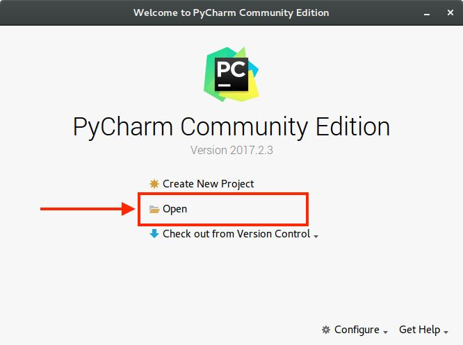
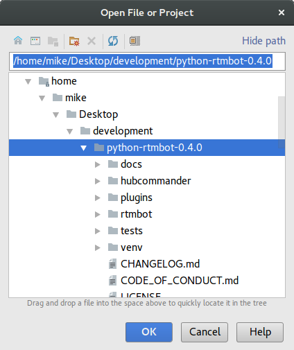
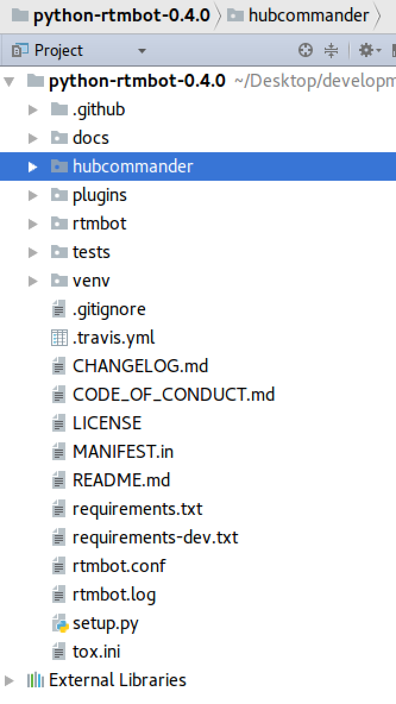
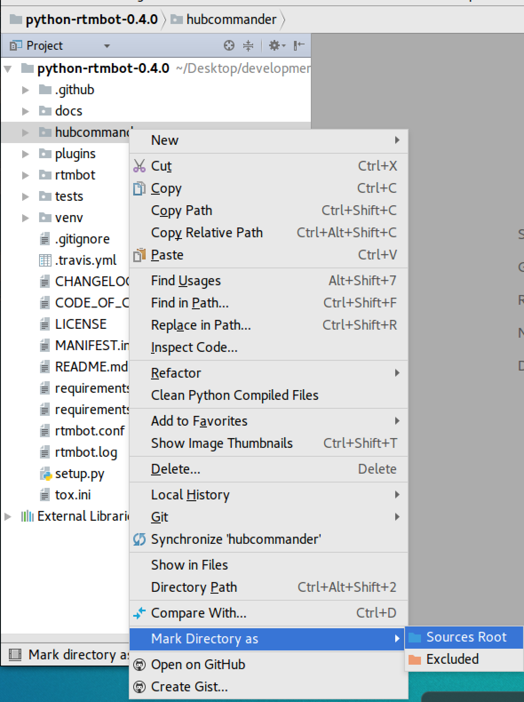
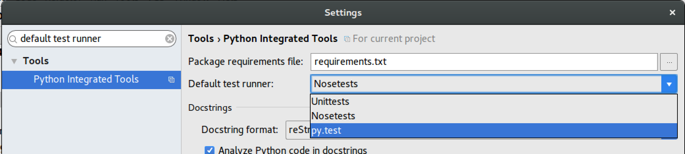
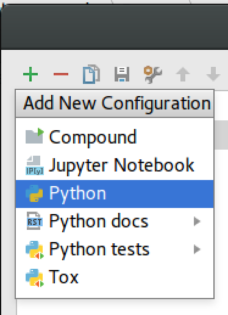
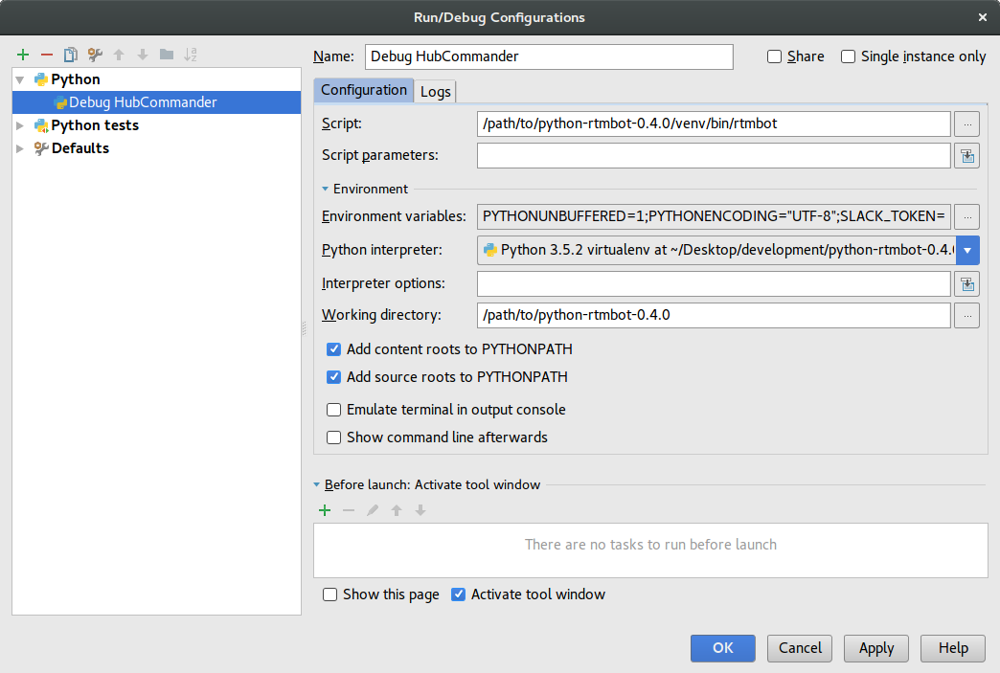

Debugging with Pycharm
=======================
This guide explains how to use [PyCharm](https://www.jetbrains.com/pycharm/) to debug HubCommander.

This guide assumes that you:
1. Have read the [contributing document](contributing.md), configured Slack, and have a working Python 3 development environment.
1. Have installed HubCommander

Once you complete those two steps, download and install PyCharm.

Get PyCharm configured
----------------------
Follow the instructions below to get PyCharm configured and working properly:

1. Open PyCharm. At the title screen click `Open`

    

1. Navigate to the directory that _contains_ the HubCommander code. Which, if following the contributing and installation
instructions, will be located in a directory named `python-rtmbot-0.4.0`. You want to open the encompassing directory.
It should look like:

    

1. You will then be presented with a new PyCharm project. On the left-side of the screen, there is the Project Viewer.
It should look similar to this:

    

1. Right-click on the `hubcommander` directory in the project viewer > `Mark Directory as` > `Sources Root`
  
    

1. On macOS, type `⌘,` -- on Linux and Windows, go to File > Settings. Next, type `Project Interpreter` in the search box.
Verify that it is set to the virtual environment that was created by the installation script.
If not, then click the gears icon > `Add Local`, and then navigate to the `venv/bin/python` that was created by the script.
Click `OK` to save and close the window.

Unit Tests First
---------------
We will now make sure that [py.test](https://docs.pytest.org/en/latest/contents.html) can run properly.

If you did not already, follow the instructions in the `Install the unit test requirements` section of the [contributing guide](contributing.md#install-the-unit-test-requirements)
to set up all the required testing dependencies.

Next, to configure PyCharm for tests, open the PyCharm preferences, and type `default test runner` in the search box. In
the drop-down for `Default test runner`, select `py.test`, then click OK.

Then, to test that it is working, expand `hubcommander` in the project explorer. Right-click on `tests`, and click
`Debug py.test in tests`. It should hopefully report that a number > 19 tests pass.

Standard debugging
-----------------
If you want to debug a feature, you can place breakpoints and then step through them. This can be immensely helpful at
debugging what's happening under the hood.

To get HubCommander runnable, you will need to make a debug configuration in PyCharm. This is somewhat identical to the
unit test section above, but will require you to define environment variables with the secrets in them.

****🚨⚠️CAUTION CAUTION CAUTION⚠️🚨**** For you to run against Slack, GitHub, Duo and the like -- you will need to have PyCharm store environment
variables with secrets in them. Please ensure that your computer is properly secured (lock screens and encrypted drives, to name a few).
If your system is ever stolen, these secrets will need to be rotated!

Follow the these steps:

1. To configure the debug configuration, go to `Run` > `Edit Configurations`, and a new Python configuration:

    

1. Under `Script`, you want to navigate to your `venv/bin/rtmbot`.

1. Under `Environment` > `Environment Variables`, you want to click the three dots (...), and click the green `+` to add in,
at a minimum, the following:
    - `PYTHONIOENCODING`: `"UTF-8"`
    - `SLACK_TOKEN`: `YOUR-SLACK-TOKEN-HERE`
    - ... and any other tokens and secrets that need to be present for you to debug

1. Set the `Working Directory` to the `python-rtmbot-0.4.0` directory.

1. Lastly... Set a name for the configuration to `Debug HubCommander`. Your configuration window should look something along
the lines of this:

    

Once this is all complete, you are ready to debug! Place breakpoints where you want them, fire up Slack, and start debugging away.
